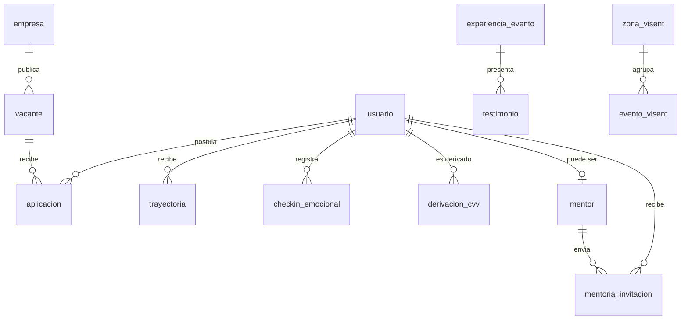

# Base de Datos — App BiT

## Archivos

| Archivo | Propósito |
|---|---|
| `schema.md` | Documento de diseño: entidades SQL, modelos MongoDB, modelos SQLite, decisiones |
| `schema.sql` | DDL ejecutable PostgreSQL 15+ (gen_random_uuid vía pgcrypto) |
| `er.mmd` | Diagrama entidad-relación en formato Mermaid |

## Diagrama ER

## Decisiones clave

- **UUIDs** en PKs: permiten merge de entornos, exponen menos, no colisionan al ingestar el dataset Vísent.
- **JSONB** para campos semiestructurados: `requisitos`, `gap_items`, `cursos_sugeridos`, `contexto`, `disponibilidad`, `humor_asociado`. La forma cambia con cada release del agente IA; un esquema rígido rompería.
- **`VARCHAR` libre** para `genero`, `humor`, `escolaridad`: la población objetivo usa identidades no contempladas en enums.
- **Timestamps con `TIMESTAMPTZ`**: imprescindible para LATAM + Angola + Brasil.
- **Log de derivaciones CVV** separado del checkin: el dato es sensible y se audita, pero no se mezcla con la serie emocional del usuario.

## Próximos pasos

1. Revisar con el equipo el catálogo de `humor` y `humor_asociado` antes de sembrar.
2. Definir el formato exacto de `requisitos` (vacante) y `gap_items` (trayectoria) para que el agente IA tenga contrato estable.
3. Cargar el dataset Vísent en `zona_visent` desde `appbit-hackathon`.
4. Sembrar `curso` con los programas confirmados (GEAR, ONE, etc.).
